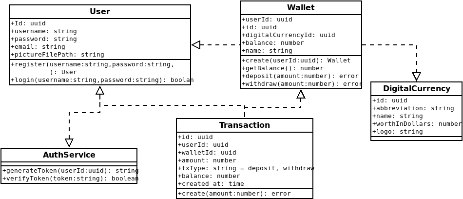

<p align="center">
  <a href="http://nestjs.com/" target="blank"></a>
</p>

[circleci-image]: design-diagrams/app-logo.jpeg
[circleci-url]: https://circleci.com/gh/nestjs/nest

  <p align="center">Web api for nsawo digital wallet</p>


## Description
Backend api for nsawo digitall wallet, a wallet service that enables users to create virtual wallets for different digital currencies like etherum, bitcoin etc

Meet the front-end next.js app [here](https://github.com/nsawo-digital/nsawo-frontend)

### Features
- Create wallet
- Deposit money to the wallet
- Withdraw money
- login
- logout
- and more ...

## App design


## Get the app
```bash
#Clone the repository
$ git clone https://github.com/nsawo-digital/nsawo-api.git

#enter the directory
$ cd nsawo-api
```

## Installation

```bash
$ npm install
```

## Running the app

```bash
# development
$ npm run start

# watch mode
$ npm run start:dev

# production mode
$ npm run start:prod
```

## Test

```bash
# unit tests
$ npm run test

# e2e tests
$ npm run test:e2e

# test coverage
$ npm run test:cov
```
### Tech stack
- nest.js
- typescript
- postgresql
- typeOrm
